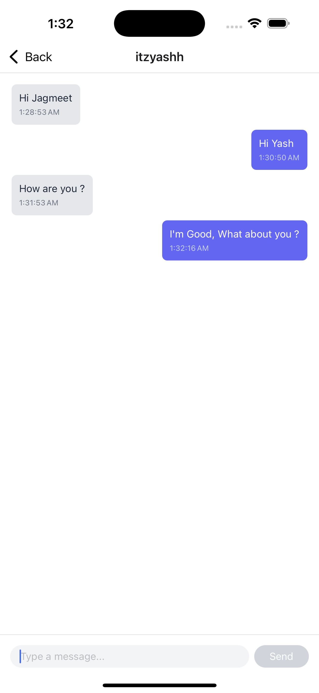
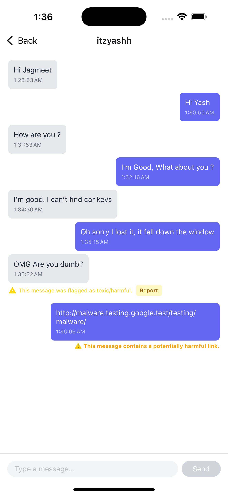

# Real-time Chat Moderation System

A comprehensive system for real-time moderation of chat messages to detect and prevent toxic content, fraud, and scams.

## Features

- Real-time content moderation using TensorFlow.js toxicity model
- Scam and fraud detection with regex pattern matching
- Socket.io for real-time messaging
- MongoDB for data persistence
- React Native client application
- Express.js backend

## Screenshots

<p align="center">
  
  
  
</p>

## Project Structure

The project consists of two main parts:

- `server/`: Backend API and moderation service
- `client/`: React Native mobile application

## Server Technology

- Node.js with Express.js
- Socket.io for real-time communication
- MongoDB with Mongoose ORM
- TensorFlow.js for toxicity detection

## Client Technology

- React Native with Expo
- Socket.io client for real-time messaging
- React Navigation for app navigation

## Getting Started

### Prerequisites

- Node.js (v14 or higher)
- MongoDB
- Yarn package manager

### Server Setup

1. Navigate to the server directory:
   ```
   cd server
   ```

2. Install dependencies:
   ```
   yarn
   ```

3. Create a `.env` file with the following content:
   ```
   PORT=5000
   MONGODB_URI=mongodb://localhost:27017/chat-moderation
   ```

4. Start the server:
   ```
   yarn start
   ```

### Client Setup

1. Navigate to the client directory:
   ```
   cd client
   ```

2. Install dependencies:
   ```
   yarn
   ```

3. Start the Expo development server:
   ```
   yarn start
   ```

## Content Moderation

The system uses multiple approaches for content moderation:

1. **Toxicity Detection**: Using TensorFlow.js toxicity model to detect toxic content such as identity attacks, insults, obscenity, and threats.
2. **Scam Detection**: Using regex patterns to identify common scam and fraud attempts.
3. **User Reporting**: Allowing users to report messages that bypass automated detection.

## API Endpoints

- `/api/auth/register`: Register a new user
- `/api/auth/login`: Login a user
- `/api/chat/rooms`: Get all chat rooms
- `/api/chat/rooms/:roomId/messages`: Get messages for a specific room
- `/api/chat/messages/:messageId/report`: Report a message
- `/api/chat/flagged-messages`: Get all flagged messages (admin only)
